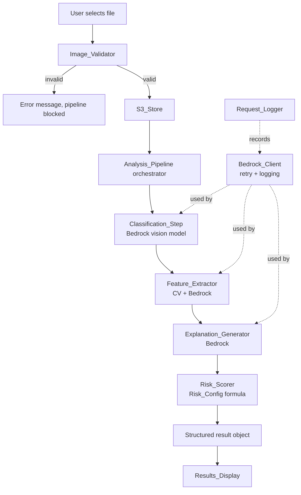

# Design Document: AI Mole Analysis Pipeline

## Overview

The AI Mole Analysis feature adds a structured four-step backend pipeline to PocketDerm's "New Scan" flow. When a user uploads a skin lesion image, the system validates the file, stores it securely in S3, then runs four sequential pipeline steps — classification, feature extraction, explanation generation, and risk scoring — all powered by Amazon Bedrock (Claude) and classical computer-vision techniques. Results are returned as a single structured object and rendered in four sections on the frontend.

The existing `bedrock.js` already handles AWS Signature V4 signing and a single Bedrock call. This design extends that foundation into a modular, independently-testable pipeline with retry logic, observability, and a configurable risk-scoring formula.

### Key Design Decisions

- **Sequential pipeline over parallel**: Each step's output feeds the next, so sequential execution is required. The 15-second SLA is achievable given typical Bedrock latency (~2–4 s per call) plus CV processing.
- **Classical CV for geometry, Bedrock for semantics**: Border regularity, symmetry, and boundary points are computed locally (no API cost, deterministic). Color uniformity requires higher-level visual judgment and uses Bedrock.
- **Config-driven risk scoring**: Weights live in `risk-config.json` so they can be tuned without code changes.
- **Frontend-only storage of image data URLs**: Images are stored in S3 server-side; the browser only holds the data URL in memory for the current session.

---

## Architecture



### Module Boundaries

| Module | Responsibility | External deps |
|---|---|---|
| `imageValidator.js` | MIME type, size, decode checks | Browser File API |
| `s3Store.js` | Encrypted per-user S3 upload | AWS SDK / fetch |
| `bedrockClient.js` | Signed Bedrock invocations, exponential backoff, logging | AWS Bedrock Runtime |
| `requestLogger.js` | Structured log entries (no PII, no image data) | Console / CloudWatch |
| `classificationStep.js` | Step 1 — category label + confidence | bedrockClient |
| `featureExtractor.js` | Step 2 — CV geometry + Bedrock color uniformity | Canvas API, bedrockClient |
| `explanationGenerator.js` | Step 3 — plain-language ABCDE explanation | bedrockClient |
| `riskScorer.js` | Step 4 — risk level + numeric score | risk-config.json |
| `analysisPipeline.js` | Orchestrates steps 1–4 in sequence | all step modules |
| `resultsDisplay.js` | Renders four result sections + disclaimer | DOM |

---

## Components and Interfaces

### Image_Validator

```js
/**
 * @param {File} file
 * @returns {{ valid: true, file: File } | { valid: false, error: string }}
 */
function validateImage(file)
```

Checks in order:
1. MIME type is `image/jpeg` or `image/png`
2. `file.size <= 10 * 1024 * 1024` (10 MB)
3. Decodes the file via `createImageBitmap()` to confirm it is a valid image

Returns a discriminated union so callers can branch on `valid` without throwing.

---

### Bedrock_Client

```js
/**
 * @param {{ modelId: string, body: object, requestId: string }} params
 * @returns {Promise<object>} parsed response content
 * @throws {BedrockError} after max retries
 */
async function invokeModel(params)
```

Retry policy: exponential backoff — delays of 1 s, 2 s, 4 s — for retryable HTTP status codes (429, 500, 502, 503). Non-retryable errors (400, 401, 403) are thrown immediately. After 3 failed attempts the error is re-thrown and logged via `Request_Logger`.

---

### Classification_Step

```js
/**
 * @param {string} imageBase64  - base64-encoded image data
 * @param {string} mediaType    - 'image/jpeg' | 'image/png'
 * @returns {Promise<ClassificationResult>}
 */
async function classifyLesion(imageBase64, mediaType)
```

Sends the image to the Bedrock vision model with a structured prompt requesting a JSON response. Validates that the returned `category` is one of the five allowed labels and that `confidence` is in [0.0, 1.0].

---

### Feature_Extractor

```js
/**
 * @param {string} imageBase64
 * @param {string} mediaType
 * @returns {Promise<FeatureMetrics>}
 */
async function extractFeatures(imageBase64, mediaType)
```

Two-phase extraction:
1. **Classical CV** (via Canvas API + pixel analysis): border regularity score, symmetry score, normalized boundary points array, estimated surface area (if scale reference detected).
2. **Bedrock call**: color uniformity score (semantic judgment).

---

### Explanation_Generator

```js
/**
 * @param {ClassificationResult} classification
 * @param {FeatureMetrics} features
 * @returns {Promise<string>} explanation text (120–200 words, ends with Disclaimer)
 */
async function generateExplanation(classification, features)
```

Constructs a prompt that includes the classification label, confidence, and all feature metrics. Instructs the model to reference ABCDE criteria and append the Disclaimer as the final sentence. Validates word count (120–200) before returning.

---

### Risk_Scorer

```js
/**
 * @param {number} confidence        - classification confidence [0, 1]
 * @param {FeatureMetrics} features
 * @returns {RiskResult}             - { level: 'low'|'moderate'|'high', score: number }
 */
function scoreRisk(confidence, features)
```

Pure function — no async, no side effects. Reads weights from the imported `Risk_Config` object at module load time.

---

### Analysis_Pipeline

```js
/**
 * @param {File} validatedFile
 * @param {string} userId
 * @returns {Promise<PipelineResult>}
 */
async function runPipeline(validatedFile, userId)
```

Orchestrates: S3 upload → classify → extract → explain → score. Returns a `PipelineResult` or throws a `PipelineError` with a `step` field indicating which step failed.

---

### Request_Logger

```js
/**
 * @param {{ requestId: string, durationMs: number, modelId: string }} entry
 */
function logSuccess(entry)

/**
 * @param {{ requestId: string, errorCode: string, modelId: string }} entry
 */
function logFailure(entry)
```

Both functions explicitly omit any image data or user PII from log entries.

---

## Data Models

### ClassificationResult

```ts
interface ClassificationResult {
  category: 'common nevus' | 'atypical nevus' | 'seborrheic keratosis' | 'melanoma-suspicious' | 'other';
  confidence: number; // [0.0, 1.0]
}
```

### FeatureMetrics

```ts
interface FeatureMetrics {
  borderRegularity: number;       // [0.0, 1.0]
  symmetryScore: number;          // [0.0, 1.0]
  colorUniformity: number;        // [0.0, 1.0]
  boundaryPoints: Array<{ x: number; y: number }>; // normalized [0,1] coords
  estimatedAreaMm2: number | null; // null when no scale reference
}
```

### RiskResult

```ts
interface RiskResult {
  level: 'low' | 'moderate' | 'high';
  score: number; // [0, 100]
}
```

### PipelineResult

```ts
interface PipelineResult {
  classificationResult: ClassificationResult;
  featureMetrics: FeatureMetrics;
  explanationText: string;
  riskResult: RiskResult;
  disclaimer: string;
  s3Key: string;
}
```

### Risk_Config (risk-config.json)

```json
{
  "weights": {
    "classificationConfidence": 0.40,
    "borderRegularity": 0.20,
    "symmetryScore": 0.20,
    "colorUniformity": 0.20
  },
  "thresholds": {
    "low": 40,
    "moderate": 70
  }
}
```

The numeric risk score is computed as:

```
rawScore = confidence * w_conf + (1 - borderRegularity) * w_border
         + (1 - symmetryScore) * w_sym + (1 - colorUniformity) * w_color
score = round(rawScore * 100)
level = score < thresholds.low ? 'low'
      : score < thresholds.moderate ? 'moderate'
      : 'high'
```

(Higher feature scores indicate healthier appearance, so they are inverted before weighting.)

---

## Correctness Properties

*A property is a characteristic or behavior that should hold true across all valid executions of a system — essentially, a formal statement about what the system should do. Properties serve as the bridge between human-readable specifications and machine-verifiable correctness guarantees.*

### Property 1: Image validation accepts only valid MIME types and sizes

*For any* file, the Image_Validator SHALL accept it if and only if its MIME type is `image/jpeg` or `image/png` AND its size is ≤ 10 MB. Any file failing either condition must be rejected with an error, and the pipeline must not be invoked.

**Validates: Requirements 1.1, 1.2, 1.3, 1.5**

---

### Property 2: S3 key always contains the user ID prefix

*For any* authenticated user ID and any valid image file, the S3 key produced by S3_Store SHALL begin with a prefix that includes the user's unique identifier.

**Validates: Requirements 2.3**

---

### Property 3: Classification output is always in the valid domain

*For any* image input, the Classification_Step SHALL return a `category` that is one of the five allowed labels (`common nevus`, `atypical nevus`, `seborrheic keratosis`, `melanoma-suspicious`, `other`) and a `confidence` value in [0.0, 1.0].

**Validates: Requirements 3.1, 3.2, 3.3**

---

### Property 4: Bedrock_Client retries exactly up to 3 times on retryable errors

*For any* Bedrock invocation that receives only retryable error responses, the Bedrock_Client SHALL make exactly 3 total attempts (1 initial + 2 retries) before returning a failure, with each retry delayed by exponential backoff.

**Validates: Requirements 3.4, 5.5**

---

### Property 5: Feature metrics are always in valid ranges

*For any* image input, the Feature_Extractor SHALL return a `FeatureMetrics` object where `borderRegularity`, `symmetryScore`, and `colorUniformity` are each in [0.0, 1.0], all `boundaryPoints` have `x` and `y` coordinates in [0.0, 1.0], and `estimatedAreaMm2` is either a positive number (when a scale reference is present) or `null` (when absent).

**Validates: Requirements 4.1, 4.2, 4.3, 4.4, 4.5, 4.6**

---

### Property 6: Generated explanation satisfies word count, ABCDE coverage, and Disclaimer

*For any* valid `ClassificationResult` and `FeatureMetrics`, the Explanation_Generator SHALL return a string whose word count is between 120 and 200 (inclusive), that contains references to all five ABCDE criteria (Asymmetry, Border, Color, Diameter, Evolution), and whose final sentence is exactly the Disclaimer text.

**Validates: Requirements 5.1, 5.2, 5.3, 10.1, 10.3**

---

### Property 7: Risk score and level are always in valid domain

*For any* `confidence` in [0.0, 1.0] and valid `FeatureMetrics`, the Risk_Scorer SHALL return a `score` in [0, 100] and a `level` that is one of `low`, `moderate`, or `high`, consistent with the thresholds defined in Risk_Config.

**Validates: Requirements 6.1, 6.2, 6.3**

---

### Property 8: Pipeline result contains all required fields

*For any* valid image that passes validation, when all four pipeline steps succeed, the `PipelineResult` returned by Analysis_Pipeline SHALL contain non-null values for `classificationResult`, `featureMetrics`, `explanationText`, `riskResult`, `disclaimer`, and `s3Key`, with each field conforming to its declared type.

**Validates: Requirements 7.1, 7.2, 7.4**

---

### Property 9: Results_Display renders all four sections and the Disclaimer for any result

*For any* `PipelineResult`, the Results_Display render function SHALL produce output that contains: the category label and confidence score (Classification section), all five feature metrics including boundary visualization (Metrics section), the explanation text (Medical Explanation section), the risk level and numeric score (Overall Risk section), and the exact Disclaimer text as a persistently visible element.

**Validates: Requirements 9.1, 9.2, 9.3, 9.4, 9.5, 10.2**

---

### Property 10: Request logs contain required fields and no sensitive data

*For any* Bedrock invocation (successful or failed), every log entry produced by Request_Logger SHALL contain `requestId` and either `durationMs` (on success) or `errorCode` (on failure), and SHALL NOT contain any image data or personally identifiable information.

**Validates: Requirements 11.1, 11.2, 11.3, 11.4**

---

## Error Handling

### Validation Errors (pre-pipeline)

| Condition | Behavior |
|---|---|
| Unsupported MIME type | `validateImage` returns `{ valid: false, error: "Only JPEG and PNG files are supported." }` |
| File > 10 MB | `validateImage` returns `{ valid: false, error: "File must be 10 MB or smaller." }` |
| Corrupted / undecodable | `validateImage` returns `{ valid: false, error: "The file could not be read as an image." }` |

The Upload_Component displays the `error` string inline. The pipeline is never invoked.

### Pipeline Step Errors

Each step throws a typed `StepError`:

```ts
interface StepError extends Error {
  step: 'classification' | 'featureExtraction' | 'explanation' | 'riskScoring';
  retryable: boolean;
  requestId?: string;
}
```

The `analysisPipeline` catches `StepError`, logs it via `Request_Logger`, and re-throws a `PipelineError` with the `step` field set. The frontend shows a user-friendly message: "Analysis failed during [step]. Please try again."

### Bedrock Retry Exhaustion

After 3 failed attempts, `bedrockClient` throws a `BedrockError` with `{ requestId, errorCode, attempts: 3 }`. This is logged (without image data or PII) and surfaces as a `StepError` to the pipeline.

### S3 Upload Failure

If the S3 upload fails, the pipeline throws immediately before any Bedrock calls are made, avoiding unnecessary API costs.

### Explanation Word Count Violation

If the Bedrock response produces an explanation outside the 120–200 word range, `explanationGenerator` retries the call once with a stricter prompt. If the second attempt also fails the check, it truncates or pads to the nearest boundary and logs a warning.

---

## Testing Strategy

### Unit Tests (example-based)

- `imageValidator`: test each rejection condition (wrong MIME, oversized, corrupted) and the happy path
- `riskScorer`: test each threshold boundary (score at 39, 40, 69, 70, 100) with known inputs
- `explanationGenerator`: test that the Disclaimer is appended and ABCDE terms are present
- `resultsDisplay`: test that all four sections render with a minimal mock `PipelineResult`
- `requestLogger`: test that log entries contain required fields and omit image/PII fields

### Property-Based Tests

The project uses **fast-check** (JavaScript PBT library). Each property test runs a minimum of **100 iterations**.

Each test is tagged with a comment in the format:
`// Feature: ai-mole-analysis, Property N: <property_text>`

| Property | Generator | Assertion |
|---|---|---|
| P1: Image validation | Arbitrary MIME types, file sizes | Accept iff jpeg/png AND ≤ 10 MB; pipeline not called on rejection |
| P2: S3 key prefix | Arbitrary user IDs (UUID-like strings) | Key starts with user ID prefix |
| P3: Classification domain | Arbitrary base64 image strings (mocked Bedrock) | Category in allowed set; confidence in [0, 1] |
| P4: Retry count | Mocked Bedrock returning retryable errors | Exactly 3 attempts made |
| P5: Feature metrics ranges | Arbitrary image pixel data | All scores in [0, 1]; boundary points in [0, 1]; area positive or null |
| P6: Explanation invariants | Arbitrary ClassificationResult + FeatureMetrics (mocked Bedrock) | Word count 120–200; all ABCDE terms present; ends with Disclaimer |
| P7: Risk score domain | Arbitrary confidence [0,1] + FeatureMetrics | Score in [0, 100]; level in {low, moderate, high}; consistent with config thresholds |
| P8: Pipeline result completeness | Arbitrary valid images (all steps mocked) | All six required fields present with correct types |
| P9: Results rendering completeness | Arbitrary PipelineResult objects | All four sections + Disclaimer present in rendered output |
| P10: Log entry safety | Arbitrary Bedrock call params including image data and user IDs | Log entries contain requestId + durationMs/errorCode; no image data or PII |

### Integration Tests

- End-to-end pipeline with real Bedrock calls (1–2 representative images): verify latency < 15 s and result shape
- S3 upload: verify object is stored with correct key prefix and SSE header
- Bedrock retry: verify retry behavior against a mock server returning 429s

### Smoke Tests

- S3 bucket has SSE enabled
- Risk_Config file is present and parseable
- All pipeline step modules are independently importable and callable
